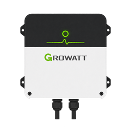

# HA Growatt

### Local Growatt readings, cloud forwarding and inverter tools for Home Assistant.

[Quick start](#quick-start) · [Features](#what-you-get) · [Hardware](#supported-hardware) · [Migration](#moving-from-an-existing-installation) · [Troubleshooting](#troubleshooting) · [Development](#development)

---

HA Growatt receives traffic from your Growatt datalogger and publishes inverter
readings to Home Assistant through MQTT. You can keep forwarding to Growatt for
ShinePhone, or use the service locally. If the cloud stops responding, local
fallback keeps supported readings flowing to Home Assistant.

There are two parts:

| Component | Purpose |
| --- | --- |
| **HA Growatt app** | Receives datalogger traffic, publishes sensors and provides the setup and troubleshooting UI. Install this first on Home Assistant OS. |
| **Optional companion integration** | Adds daylight-aware Repairs, buffered-reading events and history-adoption tools through HACS. It uses the app's MQTT connection and creates no duplicate measurement sensors. |

The service can also run in Docker or Python outside Home Assistant. The
companion still needs a running HA Growatt service and the same MQTT broker.

> [!NOTE]
> **Release status:** The badge above shows the latest published version. The
> features under [Version 0.5.0](#version-050) require that version of the app;
> the companion's new actions also require its 0.5.0 update.

## Quick start

### Requirements

- Home Assistant OS for the app, or a separate machine running Docker or Python 3.12+.
- A working MQTT broker and the MQTT integration in Home Assistant.
- A supported Growatt datalogger that can send traffic to your service's LAN address.
- Access to the datalogger's upload-server settings and a stable address for the service.

### 1. Install the app

In **Settings → Apps → App store → Repositories**, add:

~~~text
https://github.com/Herbertmt978/HA-Growatt
~~~

Install **HA Growatt**. For a local Mosquitto installation, leave **mqtt_auto**
enabled and the MQTT username and password empty so the app can use Supervisor's
broker configuration. Existing explicit credentials take priority. For an
external broker, enter its address and credentials in the app options.

Start the app and open its web UI. The guided setup checks the broker,
datalogger connection, fresh readings, profiles and history mappings.

### 2. Connect your datalogger

Set the datalogger's upload server to Home Assistant's stable LAN address and
the app's published TCP port, normally **5279**. Use the published host port,
not the web UI address. Keep the cloud forwarding defaults if you use ShinePhone.

Datalogger settings vary by model and firmware. If yours does not let you change
the server, check the [datalogger limitations](docs/hardware-support.md) before
changing your network or firmware.

### 3. Check the readings

1. Wait for fresh readings from every inverter. Solar-only inverters may be silent overnight.
2. Open **Settings → Devices & services → MQTT** and check the inverter devices.
3. Compare power and daily energy with the inverter display or your existing readings.
4. Keep the reading profile on **Automatic** while decoding is correct.
5. Review the Energy Dashboard before adding production totals, especially if another solar sensor already includes them.

The [guided setup guide](docs/guided-setup.md) covers these checks in more detail.

<b>Add the optional companion integration</b>

Add this repository to HACS with category **Integration**, download **HA Growatt**
and restart Home Assistant. Then open **Settings → Devices & services → Add
integration** and select **HA Growatt**.

For a manual installation, copy the [companion directory](custom_components/ha_growatt)
into /config/custom_components/ha_growatt, restart Home Assistant and add the
integration. Repeat the copy after each manual upgrade.

Keep the app or standalone service running. The companion is not a replacement
for the datalogger receiver. See [the companion guide](docs/home-assistant-features.md).

## What you get

| Area | Capability |
| --- | --- |
| Readings | MQTT discovery with stable device and sensor identifiers, units and statistics metadata. The standard generic and MOD profiles expose 32 measurement sensors; full discovery includes other decoded fields. |
| Cloud resilience | Local acknowledgements during cloud failures, protocol health checks and controlled reconnection when forwarding can resume. ShinePhone does not receive readings while a connection is local. |
| Restart recovery | Saved readings return after a quiet restart with their original timestamps. Restored values are distinguished from fresh telemetry. |
| Setup | Guided installation, automatic broker configuration, per-inverter profiles and a searchable hardware evidence catalogue. |
| Troubleshooting | Connection checks, redacted diagnostics and a history/Energy preview. The optional companion suppresses missing-status notices overnight and during the sunrise grace period. Explicit app-offline notices still warn. |
| Controls | Supported output limits and family-specific battery settings. Settings must respond to a read before becoming available; writes are checked by reading back the result. |
| Other installations | Proxy, standalone server and Linux passive sniffer modes; raw MQTT, PVOutput, InfluxDB 1 and 2, CSV, HTTP and Python extension outputs. |

Experimental battery schedules and additional model controls are **off by
default**. A successful telemetry connection does not qualify a control.

## How it works

~~~mermaid
flowchart LR
    Inverter[Growatt inverter] --> Logger[Growatt datalogger]
    Logger --> App[HA Growatt service]
    App -->|Optional forwarding| Cloud[Growatt cloud / ShinePhone]
    App --> MQTT[MQTT broker]
    MQTT --> HA[Home Assistant sensors]
    MQTT --> Companion[Optional companion integration]
~~~

The service supports protocol versions 2, 5 and 6, 15 built-in layouts, custom
JSON layouts and per-device family selection. Existing INI files, environment
overrides, app options and the Home Assistant service TOML configuration are
supported. See [configuration](docs/configuration.md) for the available settings.

## Supported hardware

The installation used for physical telemetry checks has a **Growatt MIN
2500TL-XH** and a **Growatt MIC 2000TL-X**, both with **ShineWiFi-X** dataloggers.
Their saved inverter firmware readings are AL1.0 and GH1.0 respectively; logger
firmware is unconfirmed. Both working feeds decode through the MOD layout.

The [hardware matrix](docs/hardware-matrix.md) distinguishes our physical
checks, manufacturer documentation and results reported by other projects.
Other model families have protocol coverage, but that is not a claim that we
have tested every inverter or firmware. Battery controls have not been
physically qualified on this installation.

Some Shine dataloggers use session-key encryption that this service cannot
decode. Check the [hardware support guide](docs/hardware-support.md) before
assuming that a connected logger will produce usable readings.

## Moving from an existing installation

Back up Home Assistant and keep a recoverable copy of the old service and its
effective configuration. Preserve the broker, topics, discovery settings,
layouts and port mapping. Stop the old receiver before starting HA Growatt on
the same port.

Use the app's history/Energy preview, then confirm fresh readings, cloud
forwarding, existing entities and Recorder history. MQTT topics retain their
existing technical prefix to preserve compatibility. A running container alone
does not establish a successful migration.

Follow the [installation and migration instructions](docs/installation.md) and
check the [compatibility record](docs/compatibility.md) before retiring the old service.

## Version 0.5.0

This version adds:

- Separate datalogger devices, connection history and explanations of model-specific control availability.
- Clock comparisons, model-scoped operating states, MIC fault descriptions, packet-format checks and cloud-write evidence.
- Explicit hardware identification that reports firmware, available model text and family hints without changing profiles or enabling controls.
  - Read-only holding-register inspection in the app and companion actions, with before/after comparisons and a private report download.
  - A paced, read-only direct Modbus TCP scanner for input and holding registers, with a private response map for investigating unfamiliar hardware. Direct Modbus results are kept separate from Shine compatibility.
- Shareable packet evidence without serials or readings, plus serial-redacted and private offline replay files for deeper investigations.
- A fresh MQTT app-status check during companion setup, direct installation links and clearer guidance when the two components use different brokers.
- Hardware reports from 0xAHA's direct-Modbus work, labelled separately from HA Growatt's verified Shine telemetry.

See [reading diagnostics](docs/home-assistant-features.md#reading-and-setting-diagnostics-050)
and [identification and register tools](docs/register-tools.md) for limits and instructions.

## Troubleshooting

Start with the app's **Connection checks** and Log tab. Confirm that the app and
Home Assistant use the same broker, the host port is published and the logger
is sending to the right LAN address. If a solar-only feed is silent, check again
in daylight before treating it as a fault.

When reporting a problem, include the app and companion versions, inverter and
datalogger models, firmware if known, and redacted diagnostics. Describe what
you expected and what happened. Keep credentials, real packet captures and raw
register reports out of public issues.

[Open an issue](https://github.com/Herbertmt978/HA-Growatt/issues) ·
[Feature and troubleshooting guide](docs/home-assistant-features.md)

## Run outside Home Assistant

For Docker, use the [installation guide](docs/installation.md). Standalone images
support amd64, arm64, arm/v7 and 386; the Home Assistant app supports amd64 and
aarch64. Passive sniffing needs Linux and access to the datalogger's traffic.

With Python 3.12+ and [uv](https://docs.astral.sh/uv/):

~~~sh
uv sync --locked
uv run --locked ha-growatt run --config /path/to/ha-growatt.ini
~~~

An existing INI file can be used directly. The
[Home Assistant example](examples/ha-growatt.ini) enables cloud forwarding,
command blocking and standard discovery.

## Development

Use a separate broker and synthetic device identities. Keep credentials and
real packet captures outside the repository. Run these checks before publishing:

~~~sh
uv sync --locked
uv run --locked ruff check src tests custom_components
uv run --locked ruff format --check src tests custom_components
uv run --locked pytest -q
uv run --locked python -m build --no-isolation
~~~

Run the Python checks on 3.12, 3.13 and 3.14. Packaging changes also require
container checks on amd64, arm64, arm/v7 and 386. A release requires native
Home Assistant migration and restart checks, then fresh readings from both
inverters in the installation being replaced.

The native [feature](tests/ha_feature_probe.py) and
[reliability](tests/ha_reliability_probe.py) probes exercise real MQTT, entities,
controls, Repairs, reload, unload and history adoption in a disposable
Home Assistant instance.

To inspect an extracted and reassembled binary TCP stream without publishing:

~~~sh
uv run --locked ha-growatt inspect sample.bin
~~~

This reports record types, sizes and register counts without printing identities
or packet contents. PCAP streams must be extracted and reassembled first.

## Disclaimer

By using HA Growatt, you accept responsibility for the security of the data you
extract. Neither HA Growatt nor Growatt can be held responsible for data breaches
stemming from the extraction of data outside of the Growatt ecosystem.

## Licence

[MIT](LICENSE), copyright Herbertmt978. Dependencies retain their own licences.
See [how the code and tests were written](docs/provenance.md).
