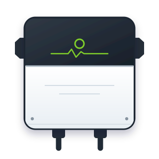

# HA Growatt

### Local Growatt readings, cloud forwarding and inverter tools for Home Assistant.

[Quick start](#quick-start) · [Features](#what-you-get) · [Hardware](#supported-hardware) · [Migration](#moving-from-an-existing-installation) · [Troubleshooting](#troubleshooting) · [Development](#development)

---

HA Growatt can receive traffic from a Growatt datalogger inside Home Assistant
or in its separate app. It can also poll a direct Modbus connection when that
connection is available. The Shine routes can forward to Growatt for ShinePhone;
local fallback keeps readings flowing when the cloud stops responding.

Choose the route that fits your installation:

| Component | Purpose |
| --- | --- |
| **Home Assistant Shine receiver** | Receives datalogger traffic inside Home Assistant. No separate app or MQTT broker is needed for readings, cloud forwarding, restart recovery, buffered events or daylight alerts. Supported controls and optional outputs can be enabled separately. |
| **Home Assistant direct Modbus** | Polls a separately accessible TCP, UDP or wired serial RTU connection. Supported MIN/MIC device codes can select a base profile automatically; other models use an explicit register profile. It reads only; it does not change inverter settings or relay Shine traffic. |
| **HA Growatt app and optional companion** | The app publishes MQTT sensors and offers guided setup, a web support page, CSV and Python-extension outputs. The companion adds Repairs, buffered events and history adoption without duplicating those sensors. |

The service can also run in Docker or Python outside Home Assistant. Existing
app and MQTT installations remain supported; adding the native receiver does
not silently move their entities or history.

> [!NOTE]
> **Release status:** The badge above shows the latest published version. The
> reviewed Shine capture evidence and the direct-Modbus identity safeguard need
> the matching 0.9.0 integration and receiver wheel. Existing app installations
> can update without changing their setup.

## Quick start

### Requirements

- Home Assistant for the one-part integration, Home Assistant OS for the app,
  or a separate machine running Docker or Python 3.12+.
- A working MQTT broker and Home Assistant's MQTT integration if using the app route.
- A Growatt datalogger that can send traffic to your service's LAN address for
  the Shine routes, or a separately accessible Modbus TCP, UDP or serial RTU
  connection for polling.
- Access to the datalogger's upload-server settings for a Shine receiver, and a
  stable address for whichever service it uses.

### Integration only: one Home Assistant installation

Add this repository to HACS as a custom **Integration** repository, download
**HA Growatt**, and restart Home Assistant. Under **Settings → Devices &
services → Add integration**, choose **HA Growatt → Receive dataloggers in Home
Assistant**. Keep the automatic profile and cloud forwarding defaults unless
your hardware needs something different. The integration downloads its pinned
receiver library from the matching release.

Point each ShineWiFi datalogger at Home Assistant's stable LAN address and the
selected TCP port, normally **5279**. Only one receiver can use a port: stop an
existing app or Docker receiver before switching that datalogger. Wait for
fresh readings, then check the inverter devices, **Connected** sensors and
daily energy values. Saved readings return after a quiet restart with their
original time; a restored reading does not mark a datalogger connected.

In the integration's **Configure** menu, supported inverter controls start
disabled. Enable them only after checking the physical model and a successful
setting read. Battery controls and schedules have a separate experimental
switch. The same menu can configure raw MQTT, PVOutput, InfluxDB or HTTP output;
each destination runs independently. Home Assistant's device pages, Repairs and
redacted diagnostic downloads provide the support information. The app still
offers its guided web page, CSV and Python extensions. Native entities have
different identifiers, so preview history adoption before retiring existing
MQTT entities. See the
[Home Assistant guide](docs/home-assistant-features.md#integration-only-installation).

### Direct Modbus

Choose **HA Growatt → Read a direct Modbus connection** only when your inverter
or gateway exposes Modbus TCP, UDP or wired serial RTU. Enter its address or
local serial device, unit number and stable device identity. UDP offers socket
(MBAP) and RTU datagram framing; choose what your gateway actually supports.
A serial adapter must be attached to the Home Assistant host and exposed to its
container, if used. **Auto** recognises
only supported MIN/MIC device type codes; an unknown or ambiguous model needs
a manual choice. The three-phase TL3 profile is manual and uses Growatt's
published V1.39 input table. Documented profiles read small input-register
blocks about once a minute and keep the last valid reading through a quiet
restart. Failed or
incomplete reads never replace valid measurements. Optional faster power polling
updates only current power readings; energy totals and their timestamps still
come from complete polls. A ShineWiFi-X upload
connection does not itself prove that Modbus TCP is available; check your
hardware before changing a working setup. This route is read-only and creates
separate Home Assistant entity IDs. See the [Modbus guide](docs/home-assistant-features.md#direct-modbus).

For a documented three-string MIN TL-X/XH, select the separate V1.24 profile
to see PV3 power and energy. Its extra fault and temperature readings appear
only when the inverter answers that optional block. **Investigate raw** reads
one chosen block of up to 32 input or holding registers from an unfamiliar
device. It creates disabled diagnostic entities with raw numbers, never energy
sensors, and does not save those values for restart recovery. Raw registers
may contain identifiers or settings; keep them private. Neither route has
been physically checked on this installation.

For a gateway that cannot answer 32-word reads, reduce the maximum block size
in the integration's connection options. Request delay and timeout can also be
adjusted there. Existing installations keep the same defaults. These settings
do not establish that a ShineWiFi-X exposes a direct Modbus connection.

### App and MQTT

#### 1. Install the app

In **Settings → Apps → App store → Repositories**, add:

~~~text
https://github.com/Herbertmt978/HA-Growatt
~~~

Install **HA Growatt**. For a local Mosquitto installation, leave **mqtt_auto**
enabled and the MQTT username and password empty so the app can use Supervisor's
broker configuration. Existing explicit credentials take priority. For an
external broker, enter its address and credentials in the app options.

Start the app and open its web UI. The guided setup checks the broker,
datalogger connection, fresh readings, profiles and history mappings.

#### 2. Connect your datalogger

Set the datalogger's upload server to Home Assistant's stable LAN address and
the app's published TCP port, normally **5279**. Use the published host port,
not the web UI address. Keep the cloud forwarding defaults if you use ShinePhone.

Datalogger settings vary by model and firmware. If yours does not let you change
the server, check the [datalogger limitations](docs/hardware-support.md) before
changing your network or firmware.

#### 3. Check the readings

1. Wait for fresh readings from every inverter. Solar-only inverters may be silent overnight.
2. Open **Settings → Devices & services → MQTT** and check the inverter devices.
3. Compare power and daily energy with the inverter display or your existing readings.
4. Keep the reading profile on **Automatic** while decoding is correct.
5. Review the Energy Dashboard before adding production totals, especially if another solar sensor already includes them.

The [guided setup guide](docs/guided-setup.md) covers these checks in more detail.

<b>Add the optional companion integration</b>

Add this repository to HACS with category **Integration**, download **HA Growatt**
and restart Home Assistant. Then open **Settings → Devices & services → Add
integration** and select **HA Growatt**.

For a manual installation, copy the [integration directory](custom_components/ha_growatt)
into /config/custom_components/ha_growatt, restart Home Assistant and add the
integration. Repeat the copy after each manual upgrade.

Choose **Connect the existing HA Growatt app**. Keep the app or standalone
service and MQTT running. See the [Home Assistant guide](docs/home-assistant-features.md).

## What you get

| Area | Capability |
| --- | --- |
| Readings | MQTT discovery with stable device and sensor identifiers, units and statistics metadata. The standard generic and MOD profiles expose 32 measurement sensors; full discovery includes other decoded fields. |
| Cloud resilience | Local acknowledgements during cloud failures, protocol health checks and controlled reconnection when forwarding can resume. ShinePhone does not receive readings while a connection is local. |
| Restart recovery | Saved readings return after a quiet restart with their original timestamps. Restored values are distinguished from fresh telemetry. |
| Setup | Guided installation, automatic broker configuration, per-inverter profiles and a searchable hardware evidence catalogue. |
| Troubleshooting | Connection checks, redacted diagnostics and a history/Energy preview. The optional companion suppresses missing-status notices overnight and during the sunrise grace period. Explicit app-offline notices still warn. |
| Controls | The app and HA-only Shine receiver offer supported output limits and family-specific battery settings. Settings must respond to a read before becoming available; writes are checked by reading back the result. Direct Modbus polling never writes. |
| Other installations | Proxy, standalone server and Linux passive sniffer modes; raw MQTT, PVOutput, InfluxDB 1 and 2, and HTTP outputs in the HA-only Shine route. CSV and Python extensions remain app features. |

Experimental battery schedules and additional model controls are **off by
default**. A successful telemetry connection does not qualify a control.

## How it works

~~~mermaid
flowchart LR
    Inverter[Growatt inverter] --> Logger[Growatt datalogger]
    Logger -->|Shine upload| Receiver[HA Growatt app or HA-only receiver]
    Receiver -->|Optional forwarding| Cloud[Growatt cloud / ShinePhone]
    Receiver -->|App route| MQTT[MQTT broker]
    MQTT --> HA[Home Assistant]
    Receiver -->|HA-only route| HA
    Inverter -->|Separate Modbus TCP gateway, if present| Modbus[Read-only HA polling]
    Modbus --> HA
~~~

The service supports protocol versions 2, 5 and 6, 15 built-in layouts, custom
JSON layouts and per-device family selection. Existing INI files, environment
overrides, app options and the Home Assistant service TOML configuration are
supported. See [configuration](docs/configuration.md) for the available settings.

## Supported hardware

The installation used for physical telemetry checks has a **Growatt MIN
2500TL-XH** and a **Growatt MIC 2000TL-X**, both with **ShineWiFi-X** dataloggers.
Their saved inverter firmware readings are AL1.0 and GH1.0 respectively; logger
firmware is unconfirmed. Both working feeds decode through the MOD layout.

On 24 September 2026, both physical logger streams also produced live devices
and readings in the native Home Assistant receiver. They kept updating during
a controlled Growatt cloud outage and reconnected after cloud access returned.
The loggers were routed to DEV through a temporary transparent TCP relay, so
their final destination settings were not changed. See the
[native hardware test](docs/native-hardware-test-2026-09-24.md) for the results
and limits.

The [hardware matrix](docs/hardware-matrix.md) distinguishes our physical
checks, manufacturer documentation and results reported by other projects.
Other model families have protocol coverage, but that is not a claim that we
have tested every inverter or firmware. Battery controls have not been
physically qualified on this installation.

Some Shine dataloggers use session-key encryption that this service cannot
decode. Check the [hardware support guide](docs/hardware-support.md) before
assuming that a connected logger will produce usable readings.

## Moving from an existing installation

Back up Home Assistant and keep a recoverable copy of the old service and its
effective configuration. Preserve the broker, topics, discovery settings,
layouts and port mapping. Stop the old receiver before starting HA Growatt on
the same port.

Use the app's history/Energy preview, then confirm fresh readings, cloud
forwarding, existing entities and Recorder history. MQTT topics retain their
existing technical prefix to preserve compatibility. A running container alone
does not establish a successful migration.

Follow the [installation and migration instructions](docs/installation.md) and
check the [compatibility record](docs/compatibility.md) before retiring the old service.

## Version 0.9.0

The private capture's shareable report now highlights changing two-byte
positions in unfamiliar Shine uploads and suggests a built-in profile only
when several samples decode plausibly. It contains no packet bytes or readings
and never creates unknown sensors or a new profile. A new layout still needs
review against varied readings and a synthetic replay fixture.

Direct Modbus entries keep their connection and unit identity. To move to a
different gateway, unit or transport, add a new entry and review its readings
before retiring the old one; tuning and profile choices remain editable. The
existing Shine and MQTT routes are unchanged. See the [0.9.0 notes](docs/releases/0.9.0.md).

## Version 0.8.0

The native Shine receiver shipped in 0.7.0 was checked on the owner's MIN
2500TL-XH and MIC 2000TL-X through a temporary transparent relay on DEV. Both
feeds kept updating during a controlled Growatt cloud outage and cloud
forwarding reconnected afterwards. The dataloggers were not permanently
redirected; see the [hardware test](docs/native-hardware-test-2026-09-24.md).

Direct Modbus now offers read-only TCP, UDP and serial RTU connections,
conservative MIN/MIC auto-selection, additional documented profiles and an
optional faster power reading. The new transport and model checks use test
gateways; this installation has no confirmed direct Modbus endpoint. An
opt-in Shine diagnostic counts unfamiliar packet shapes without exposing
unknown bytes or values. See the [0.8.0 notes](docs/releases/0.8.0.md).

## Version 0.7.0

The Home Assistant Shine receiver can now show supported inverter settings
as native entities and send readings to raw MQTT, PVOutput, InfluxDB or an HTTP
endpoint. Controls and each output are optional. Settings appear only after a
live read from the connected datalogger; battery controls and schedules are
experimental and off by default. The integration also has redacted device
diagnostics and receiver health counters, so most support checks no longer
need the app's web page.

A separate, read-only Modbus TCP option polls a named inverter or gateway.
It has documented MIN, MIC and legacy register profiles, bounded requests,
connection status and restart recovery. It needs a real Modbus TCP endpoint;
the existing ShineWiFi-X feeds do not establish one. No direct Modbus hardware
or battery writes have been physically verified for this release. The app's
existing proxy, MQTT entities and Energy history are unchanged. See the
[0.7.0 notes](docs/releases/0.7.0.md).

## Version 0.6.0

HA Growatt can now receive datalogger traffic inside Home Assistant without a
separate app or MQTT broker. This route includes native measurement and
connection entities, cloud forwarding with local fallback, restart recovery,
buffered-reading events, daylight alerts, diagnostics and history-adoption
preview. The existing app route and its entity identifiers are unchanged.

When an unfamiliar packet cannot be decoded, a short private capture can now
produce a shareable report of packet shape, changing block positions and safe
decode categories. It contains no packet bytes, serials, exact times or
measurement values. The private replay remains separate.

At the time of this release, advanced controls and additional output targets
still needed the app. The app continues to provide its web support page. See
the [0.6.0 notes](docs/releases/0.6.0.md).

## Version 0.5.0

This version adds:

- Separate datalogger devices, connection history and explanations of model-specific control availability.
- Clock comparisons, model-scoped operating states, MIC fault descriptions, packet-format checks and cloud-write evidence.
- Explicit hardware identification that reports firmware, available model text and family hints without changing profiles or enabling controls.
  - Read-only holding-register inspection in the app and companion actions, with before/after comparisons and a private report download.
  - A paced, read-only direct Modbus TCP scanner for input and holding registers, with a private response map for investigating unfamiliar hardware. Direct Modbus results are kept separate from Shine compatibility.
- Shareable packet evidence without serials or readings, plus serial-redacted and private offline replay files for deeper investigations.
- A fresh MQTT app-status check during companion setup, direct installation links and clearer guidance when the two components use different brokers.
- Hardware reports from 0xAHA's direct-Modbus work, labelled separately from HA Growatt's verified Shine telemetry.

See [reading diagnostics](docs/home-assistant-features.md#reading-and-setting-diagnostics-050)
and [identification and register tools](docs/register-tools.md) for limits and instructions.

## Troubleshooting

Start with the app's **Connection checks** and Log tab. Confirm that the app and
Home Assistant use the same broker, the host port is published and the logger
is sending to the right LAN address. If a solar-only feed is silent, check again
in daylight before treating it as a fault.

When reporting a problem, include the app and companion versions, inverter and
datalogger models, firmware if known, and redacted diagnostics. Describe what
you expected and what happened. Keep credentials, real packet captures and raw
register reports out of public issues.

[Open an issue](https://github.com/Herbertmt978/HA-Growatt/issues) ·
[Feature and troubleshooting guide](docs/home-assistant-features.md)

## Run outside Home Assistant

For Docker, use the [installation guide](docs/installation.md). Standalone images
support amd64, arm64, arm/v7 and 386; the Home Assistant app supports amd64 and
aarch64. Passive sniffing needs Linux and access to the datalogger's traffic.

With Python 3.12+ and [uv](https://docs.astral.sh/uv/):

~~~sh
uv sync --locked
uv run --locked ha-growatt run --config /path/to/ha-growatt.ini
~~~

An existing INI file can be used directly. The
[Home Assistant example](examples/ha-growatt.ini) enables cloud forwarding,
command blocking and standard discovery.

## Development

Use a separate broker and synthetic device identities. Keep credentials and
real packet captures outside the repository. Run these checks before publishing:

~~~sh
uv sync --locked
uv run --locked ruff check src tests custom_components
uv run --locked ruff format --check src tests custom_components
uv run --locked pytest -q
uv run --locked python -m build --no-isolation
~~~

### Dependency updates

Dependabot opens monthly update pull requests for Ruff and pytest only. An
individual stable patch or minor update to either package can be queued for
automatic merging only when the pull request changes `pyproject.toml` and
`uv.lock` without other files.
The workflow only queues the merge; it does not approve reviews or bypass
protection. Before queueing, an active change-requesting review keeps the pull
request manual until that reviewer approves or dismisses it. The workflow does
not monitor reviews submitted after auto-merge is queued; GitHub still waits
for every required test, HACS and Home Assistant check, and required review
conversations to be resolved. Major and prerelease updates, groups, packaging
and build tools (including setuptools), Jinja templates, runtime dependencies,
and all other changes stay manual.

Merging a dependency update does not create a release, publish an artefact,
deploy the app or integration, or change an installed Home Assistant system.
Those steps remain separate and manual.

Run the Python checks on 3.12, 3.13 and 3.14. Packaging changes also require
container checks on amd64, arm64, arm/v7 and 386. A release requires native
Home Assistant migration and restart checks, then fresh readings from both
inverters in the installation being replaced.

The native [feature](tests/ha_feature_probe.py) and
[reliability](tests/ha_reliability_probe.py) probes exercise real MQTT, entities,
controls, Repairs, reload, unload and history adoption in a disposable
Home Assistant instance.

To inspect an extracted and reassembled binary TCP stream without publishing:

~~~sh
uv run --locked ha-growatt inspect sample.bin
~~~

This reports record types, sizes and register counts without printing identities
or packet contents. PCAP streams must be extracted and reassembled first.

## Disclaimer

By using HA Growatt, you accept responsibility for the security of the data you
extract. Neither HA Growatt nor Growatt can be held responsible for data breaches
stemming from the extraction of data outside of the Growatt ecosystem.

## Licence

[MIT](LICENSE), copyright Herbertmt978. Dependencies retain their own licences.
See [how the code and tests were written](docs/provenance.md).
